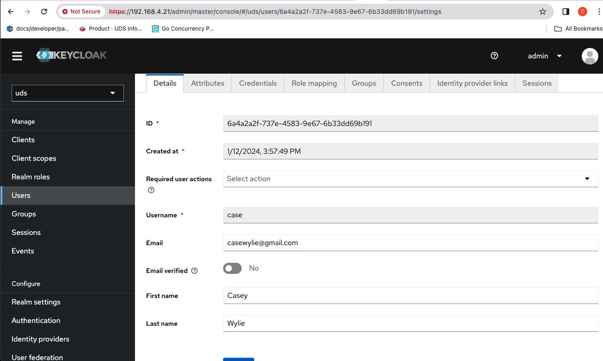

# AuthZ w/ AuthService, AuthorizationPolicy, and RequestAuthentication POC
**Revised: Jan 12, 2024**


Useful Links:
- [AuthService Docs](https://github.com/istio-ecosystem/authservice/tree/master/bookinfo-example#further-protect-via-requestauthentication-and-authorization-policy)
- [Keycloak Downloads](https://www.keycloak.org/downloads)

## Prereqs
1. Have [Keycloak](https://www.keycloak.org/downloads) downloaded
2. Have a cluster (k3d works)

TOP
- [Keycloak Setup](#keycloak-setup)
- [Istio/AuthService Setup](#istioauthservice-setup)

### Keycloak Setup 

Keycloak needs to run with a cert and key for `AuthService`.  

From your keycloak directory (Im using `keycloak-23.0.1`)
```bash
openssl req -x509 -newkey rsa:4096 -keyout key.pem -out cert.pem \
 -days 365 -nodes -subj '/CN=localhost'

./bin/kc.sh start-dev --https-certificate-file=cert.pem --https-certificate-key-file=key.pem --https-port 443
```

- Login [console](https://localhost) create a new realm `uds`

- Create a client:
  -  `Client ID=bookinfo`
  - `Client Type=OpenID Connect`
  - `Valid Redirect URIs=https://localhost:3000/productpage/oauth/callback`
  - `Client Authentication=On`
    - `Authentication Flow`
      - `standard flow and Direct access`


Go to the `Credentials` Tab and copy the client secret

```bash
export OIDC_CLIENT_ID=bookinfo
export OIDC_CLIENT_SECRET=HUxhR8ZC2ApiI3LOonoD5Tfx79x5I9tc
```

### Istio/AuthService Setup

Install istio and label default ns `istio-injection=enabled`

```bash
# istioctl for silicon in this repo
./istioctl install -y
kubectl label namespace default istio-injection=enabled --overwrite
bash ./authservice/bookinfo-example/scripts/generate-self-signed-certs-for-ingress-gateway.sh
```


Install `AuthService` via helm, update the [`values.yaml`](./authservice/bookinfo-example/authservice/values.yaml) file that sets the `oidc.clientID` and `oidc.clientSecret`.

Values for these can be found in `realmSettings.endpoints.OpenID_EndpointConfig`, follow this [link](https://0.0.0.0/realms/uds/.well-known/openid-configuration) for openid-configuration.

Install `AuthService` and make sure you have your `OIDC_CLIENT_ID` and `OIDC_CLIENT_SECRET` set:  
  
```bash
cd authservice/bookinfo-example

# make sure the OIDC_CLIENT_ID and OIDC_CLIENT_SECRET are set
helm template authservice \
   --set oidc.clientID=${OIDC_CLIENT_ID} \
   --set oidc.clientSecret=${OIDC_CLIENT_SECRET} \
   | kubectl apply --dry-run=client -oyaml -f - | egrep "client_"

helm template authservice \
   --set oidc.clientID=${OIDC_CLIENT_ID} \
   --set oidc.clientSecret=${OIDC_CLIENT_SECRET} \
   | kubectl apply -f -
```

Update the gateway bc the port is wrong :/ 
  
```yaml
kubectl replace -f -<<EOF
apiVersion: networking.istio.io/v1beta1
kind: Gateway
metadata:
  name: bookinfo-gateway
  namespace: default
spec:
  selector:
    istio: ingressgateway
  servers:
  - hosts:
    - '*'
    port:
      name: https
      number: 443
      protocol: HTTPS
    tls:
      credentialName: ingress-tls-cert
      mode: SIMPLE
EOF
```

Deploy Bookinfo:  
  
```bash
kubectl create -f https://raw.githubusercontent.com/istio/istio/release-1.20/samples/bookinfo/platform/kube/bookinfo.yaml
```

Delete the AuthorizationPolicy that needs configuring (We will get back to it later):  

```bash
kubectl delete authorizationpolicy ext-authz -n istio-system
```

(Sanity Check) Make sure you can connect locally:  

```bash
kubectl port-forward service/istio-ingressgateway 3000:443 -n istio-system
```

Visit [https://localhost:3000/productpage](https://localhost:3000/productpage) 


Now, recreate the custom AuthPolicy:

```yaml
kubectl create -f -<<EOF
apiVersion: security.istio.io/v1
kind: AuthorizationPolicy
metadata:
  name: ext-authz
  namespace: istio-system
spec:
  action: CUSTOM
  provider:
    name: authservice-grpc
  rules:
  - to:
    - operation:
        notPaths:
        - /public
  selector:
    matchLabels:
      app: istio-ingressgateway
EOF
```

Configure the external authorizer in the `extensionProviders` section of istio `cm`

```yaml
kubectl replace -f -<<EOF
apiVersion: v1
data:
  mesh: |-
    # Add the following content to define the external authorizers.
    accessLogFile: /dev/stdout
    extensionProviders:
    - name: "authservice-grpc"
      envoyExtAuthzGrpc:
        service: authservice.default.svc.cluster.local
        port: 10003
    defaultConfig:
      discoveryAddress: istiod.istio-system.svc:15012
      proxyMetadata: {}
    enablePrometheusMerge: true
    rootNamespace: istio-system
    trustDomain: cluster.local
  meshNetworks: 'networks: {}'
kind: ConfigMap
metadata:
  name: istio
  namespace: istio-system
EOF
```

**Before we go on**, check the logs for the auth service pod, we need to update a configmap if it is chatting with googleapis.com:443 (which is seems to always be)..

Check it: 


```bash
k logs -f -l app=authservice | egrep "www.googleapis.com:443"
[2024-01-12 21:30:26.451] [console] [info] Get: opening connection to www.googleapis.com:443
[2024-01-12 21:30:36.594] [console] [info] Get: opening connection to www.googleapis.com:443
[2024-01-12 21:30:46.713] [console] [info] Get: opening connection to www.googleapis.com:443
```

Get the configmap and make edits  

```bash
 k get cm authservice -oyaml | pbcopy
```

`jwks` is from the keycloak [realm endpoints](https://localhost/realms/uds/.well-known/openid-configuration -- Had to pivot here due to `AuthService` not trusting the `jwks_uri`.


**NOTE:** I'm using my local mac IP address to resolve the keycloak token uri. B/C Keycloak is not running on Kubernetes or Docker bc of the cert issues   

```yaml
k replace -f -<<EOF
apiVersion: v1
data:
  config.json: |
    {
      "listen_address": "0.0.0.0",
      "listen_port": "10003",
      "log_level": "trace",
      "threads": 8,
      "allow_unmatched_requests": "false",
      "chains": [
        {
          "name": "idp_filter_chain",
          "match": {
            "header": ":authority",
            "prefix": "localhost",
          },
          "filters": [
          {
            "oidc":
              {
                "skip_verify_peer_cert": true,
                "authorization_uri": "https://192.168.4.21/realms/uds/protocol/openid-connect/auth",
                "token_uri": "https://192.168.4.21/realms/uds/protocol/openid-connect/token",
                "callback_uri": "https://localhost:3000/productpage/oauth/callback",
                "jwks": '{"keys":[{"kid":"Gt716fqLub_NTfWLpP1sSK_TtOy_nFEy_3A6vY8ihsY","kty":"RSA","alg":"RS256","use":"sig","n":"5hqCNOF26ioLHcgpLfKEcmb54Nth9KJ01iZdsTdJI_qx7Rpl_bKJAk_dOJpSmqfN0kAWShwyitDt6qlfm09LzNncU52Who5QgmeAMtoJnHcFxzJSo4vVUun7ue1Jpn5-F9x7Rz-kCbRGgxs1G0pSSuJNY-YMJnpmlxviblm1NEEoR65sl9gPfdXvxkZ4kc1jSKjlnL7hlrIiw0a4uFguf_EZdMnt4DcBqQXc-40gb4sdaok0LKv6LvrJxpO_cc0ZP_CiXsRn4iQnSD93sXe7W9QkYmUoa0huNBIxPCsc6_655TnGomf7fbCrXNZ3tgRkKY9fRs2HnANSJNbgd9eP-Q","e":"AQAB","x5c":["MIIClTCCAX0CBgGM/6JcxDANBgkqhkiG9w0BAQsFADAOMQwwCgYDVQQDDAN1ZHMwHhcNMjQwMTEyMjE0MjU5WhcNMzQwMTEyMjE0NDM5WjAOMQwwCgYDVQQDDAN1ZHMwggEiMA0GCSqGSIb3DQEBAQUAA4IBDwAwggEKAoIBAQDmGoI04XbqKgsdyCkt8oRyZvng22H0onTWJl2xN0kj+rHtGmX9sokCT904mlKap83SQBZKHDKK0O3qqV+bT0vM2dxTnZaGjlCCZ4Ay2gmcdwXHMlKji9VS6fu57Ummfn4X3HtHP6QJtEaDGzUbSlJK4k1j5gwmemaXG+JuWbU0QShHrmyX2A991e/GRniRzWNIqOWcvuGWsiLDRri4WC5/8Rl0ye3gNwGpBdz7jSBvix1qiTQsq/ou+snGk79xzRk/8KJexGfiJCdIP3exd7tb1CRiZShrSG40EjE8Kxzr/rnlOcaiZ/t9sKtc1ne2BGQpj19GzYecA1Ik1uB314/5AgMBAAEwDQYJKoZIhvcNAQELBQADggEBAHJh+CO9pkDdVDx8hvjsbcC8Bxj2eClPlOcNTOzUKYqDDfdA6jz7p6BYFNyx6lHnnZzcuQqX2zaq+UcL6K35X7Jyhsf9RQ0nAcWEjoVVbKAHaqGiOQZI0XzxrKyB2X+9eSnOf6HibQQvtiSDbstHcNYXyECFYbMJQbA5RFayav/Xzrg3/e5Vmf0O7Yl88KYdAV3To1fJJ/WacQmiOeTE6dNSYx2MRWM7w4/u0EUdm+p8RmxXhO36LL2Q0s/XC5wSj692xElrPsnJseZjLUuXdAbAWQzsWi1lPHVu7+0U3YkESqdki+w9FRL5bRVCtRDwzvkkLHMqnhZPtNU+0+VKJDk="],"x5t":"kvq40iwTyrwAEjeldTUiMipXTx4","x5t#S256":"iJtV7iY69mdDbjbdOsuyHHuY2mn8kh5GAJSDC13bqJs"},{"kid":"IjWMJGC3SIUrA4TFilWCWFJlexfsLYWdt8cL8rhXVQs","kty":"RSA","alg":"RSA-OAEP","use":"enc","n":"xDnmpEr3hOu8lbTMztGUOhT105rk2ZiIgCMe7zcTcV3mR7kPfiWsftz6mn6H6Das6CTgp3S-q4BkpX4-CMJUR0PreNILdAbWFD2eH-df3Mm2FYGz8n11SGEH2kfODIc7Elbn7ReVtUMBPwnFGeR2O1uBtRjl4D45sOc_8710lAFAGgCRMhCwvrWdCunEK9Ha3Rsytw0k8G_d7H7zV483xVuCzvcXOH2AsBINivZMYX2FbjNbWz53Ud_Yl1Zu7ZLbu2HfkEll6scBHwUIzN5JXX0IR1RQ6vRVkZLIU1ubASKD5ogGX3S78vlnDE10hTrdRKqcAUHxjkerRZEyu2-Btw","e":"AQAB","x5c":["MIIClTCCAX0CBgGM/6JdqjANBgkqhkiG9w0BAQsFADAOMQwwCgYDVQQDDAN1ZHMwHhcNMjQwMTEyMjE0MzAwWhcNMzQwMTEyMjE0NDQwWjAOMQwwCgYDVQQDDAN1ZHMwggEiMA0GCSqGSIb3DQEBAQUAA4IBDwAwggEKAoIBAQDEOeakSveE67yVtMzO0ZQ6FPXTmuTZmIiAIx7vNxNxXeZHuQ9+Jax+3PqafofoNqzoJOCndL6rgGSlfj4IwlRHQ+t40gt0BtYUPZ4f51/cybYVgbPyfXVIYQfaR84MhzsSVuftF5W1QwE/CcUZ5HY7W4G1GOXgPjmw5z/zvXSUAUAaAJEyELC+tZ0K6cQr0drdGzK3DSTwb93sfvNXjzfFW4LO9xc4fYCwEg2K9kxhfYVuM1tbPndR39iXVm7tktu7Yd+QSWXqxwEfBQjM3kldfQhHVFDq9FWRkshTW5sBIoPmiAZfdLvy+WcMTXSFOt1EqpwBQfGOR6tFkTK7b4G3AgMBAAEwDQYJKoZIhvcNAQELBQADggEBACVo1DBRiAzdRCd5KaBk932m2BFlHgylRVYhnO8fyCZgeike8yXGD01sJSGMXwoo5gmvMcgGq/2LY7Ov2PsT0LKAaxKJpZw9652SeZlTp2ZRewPHvuPOdTMjGzMMuQNwqYFAGmXYMRjtmgUjdz5PmHqs6fRiclV65k/XQF+v7k0rWauaCeYpWoVBDQgusj0d9akQTNXsg8rp2fE1q0GQvGaXgkt7Ys4dCOVfX8Y4G8CgwX8qtFomrrHkUkFoYWWRqypMHlTUeEnYhtdSrxge/vcnT2q/PuQcudLpgh1jdAybmEPRKteo+/B9aovVu6Ock6hKMAtKNtLMnZPf3/NruN0="],"x5t":"fK4uH6CnWwFXxWnDRCAtjRf7lWQ","x5t#S256":"qd3w1FFc7xXlDfE1mR-WTyglynie4ca8ZbwdNDHa7EU"}]}',
                "client_id": "bookinfo",
                "client_secret": "HUxhR8ZC2ApiI3LOonoD5Tfx79x5I9tc",
                "scopes": [],
                "cookie_name_prefix": "productpage",
                "id_token": {
                  "preamble": "Bearer",
                  "header": "Authorization"
                },
                "logout": {
                  "path": "/authservice_logout",
                  "redirect_uri": "https://localhost:3000/some/logout/path"
                }
              }
            }
          ]
        }
      ]
    }
kind: ConfigMap
metadata:
  name: authservice
  namespace: default
EOF

k delete po -l app=authservice --force
```


Listen to pod logs, make sure googleapis.com:443 is not in there   
   
```bash
k logs -f -l app=authservice
```

Now, you can go into your keycloak realm and create a user 

Now, you can go to [https://localhost:3000/productpage](https://localhost:3000/productpage) and login with the user you created in keycloak.
